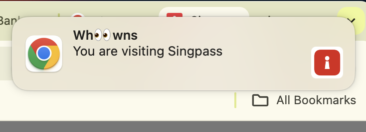

# wh👀wns

## How to install locally

It is possible to install an extension from your file system—so-called Unpacked Extensions.

Step 1 - Clone this repository.

Step 2 - Follow these instructions to load the extensions from your file system

* https://developer.chrome.com/docs/extensions/get-started/tutorial/hello-world#load-unpacked

## How it works

The `manifest.json` file describes what goes into the extension.

The extension runs `content-script.js` in the context of the loaded page.
This gives it access to `window.location.host`.
This is checked against a list of known domains.
When a match is found, a message is sent.

The extension also runs a `service-worker.js` in the background.
This listens for messages.
When a message is received of the `notification` type, it sends a notification.

Example Singpass notification shown below...

